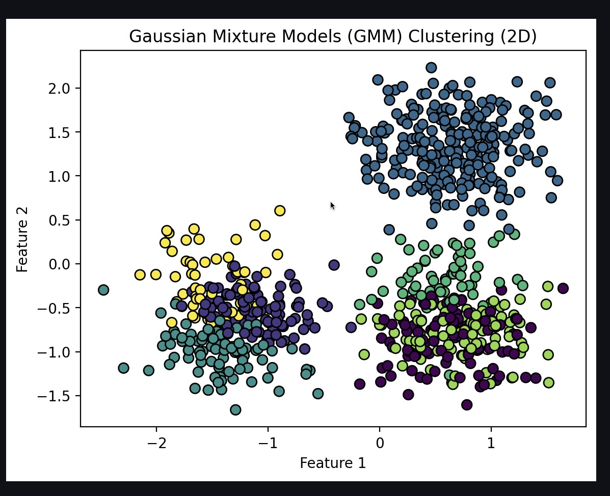
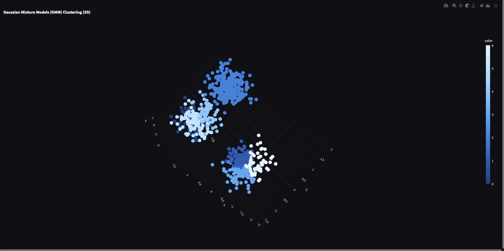
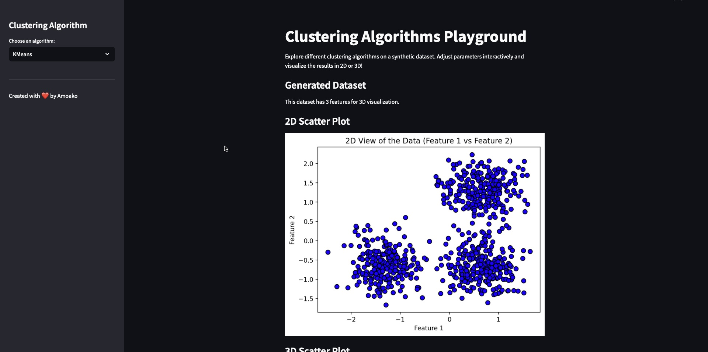

Here’s a **README.md** file for your updated Streamlit clustering app. This README provides an overview of the project, instructions for setup, and details about the features.

---

# Clustering Algorithms Playground


A Streamlit-based web application to explore and visualize various clustering algorithms on synthetic datasets. The app supports **2D and 3D visualizations** and allows users to interactively adjust clustering parameters.

---

## Features

- **Clustering Algorithms**:
  - KMeans
  - DBSCAN
  - Hierarchical Clustering
  - Gaussian Mixture Models (GMM)
  - Spectral Clustering
  - OPTICS
  - Mean Shift
  - Affinity Propagation
  - BIRCH

- **Visualizations**:
  - **2D Scatter Plots**: Visualize clusters in 2D using Matplotlib.
  - **3D Scatter Plots**: Interactive 3D visualizations using Plotly.

- **Interactive Controls**:
  - Adjust algorithm-specific parameters (e.g., number of clusters, epsilon, bandwidth).
  - Real-time updates of clustering results.

- **Synthetic Dataset**:
  - Generates a 3D synthetic dataset using `make_blobs` from Scikit-learn.

---

## Installation

1. **Clone the Repository**:
   ```bash
   git clone https://github.com/Amoako419/Clustering_App.git
   cd clustering-playground
   ```

2. **Install Dependencies**:
   Ensure you have Python 3.7+ installed. Then, install the required libraries:
   ```bash
   pip install -r requirements.txt
   ```

   Alternatively, install the dependencies manually:
   ```bash
   pip install streamlit pandas numpy matplotlib scikit-learn scipy seaborn plotly
   ```

3. **Run the App**:
   ```bash
   streamlit run clustering.py
   ```

4. **Open in Browser**:
   The app will open automatically in your default browser. If not, navigate to `http://localhost:8501`.

---

## Usage

1. **Select a Clustering Algorithm**:
   - Choose an algorithm from the sidebar dropdown menu.

2. **Adjust Parameters**:
   - Use the sliders and dropdowns to adjust algorithm-specific parameters.

3. **Visualize Results**:
   - View the clustering results in **2D** and **3D**.
   - Rotate, zoom, and pan the 3D plot for better insights.

4. **Explore Different Algorithms**:
   - Switch between algorithms and compare their performance and results.

---

## Screenshots

### 2D Visualization


### 3D Visualization


### Algorithm Selection


---

## File Structure

```
clustering-playground/
├── clustering.py  # Main Streamlit app file
├── README.md                        # Project documentation
├── requirements.txt                 # List of dependencies
└── screenshots/                     # Screenshots for the README
    ├── 2d.png
    ├── 3d.png
    └── sidebar.png
```

---

## Dependencies

- Python 3.7+
- Streamlit
- Pandas
- NumPy
- Matplotlib
- Seaborn
- Scikit-learn
- Plotly

---

## Contributing

Contributions are welcome! If you'd like to add new features, improve the code, or fix bugs, please follow these steps:

1. Fork the repository.
2. Create a new branch (`git checkout -b feature/YourFeatureName`).
3. Commit your changes (`git commit -m 'Add some feature'`).
4. Push to the branch (`git push origin feature/YourFeatureName`).
5. Open a pull request.

---

## License

This project is licensed under the MIT License. See the [LICENSE](LICENSE) file for details.

---

## Acknowledgments

- [Streamlit](https://streamlit.io/) for the amazing framework.
- [Scikit-learn](https://scikit-learn.org/) for the clustering algorithms.
- [Plotly](https://plotly.com/) for interactive 3D visualizations.

---

Enjoy exploring clustering algorithms with this interactive app! 🚀

---

### How to Add Screenshots
1. Take screenshots of the app while running.
2. Save them in the `screenshots/` folder.
3. Update the `README.md` with the correct file paths.

Let me know if you need further assistance! 😊
